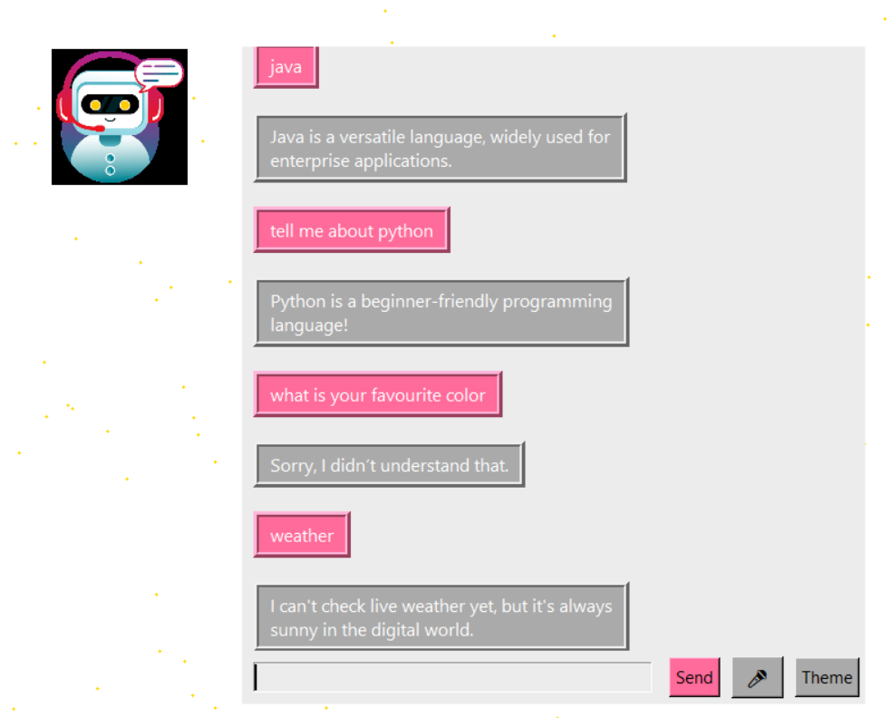
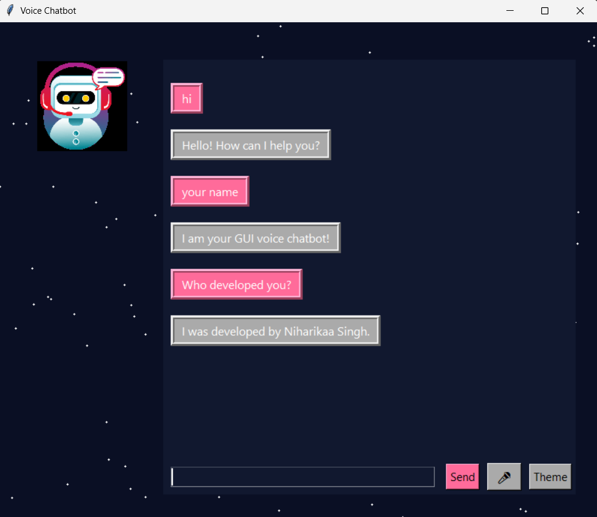
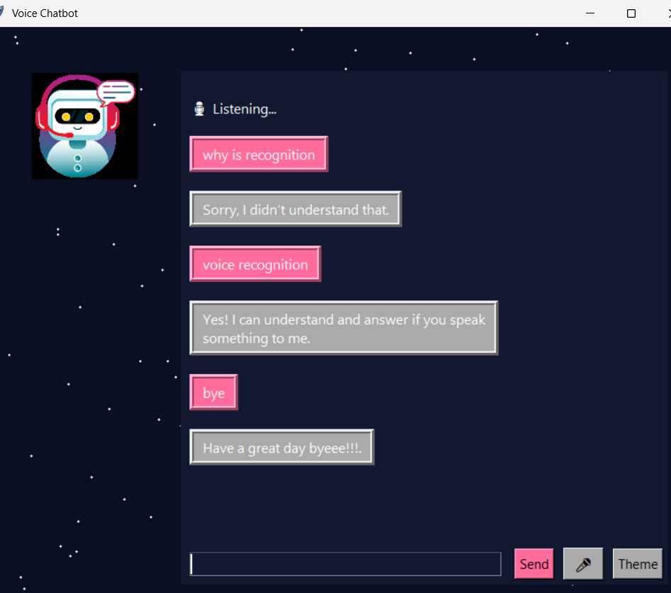

# 🌟 NiaBot – Voice GUI Chatbot


> A modern, interactive **voice-enabled GUI chatbot** with starry background, rounded chat bubbles, theme toggle, and circular avatar.

---

## ✨ Features

- 🎙 **Voice recognition & text-to-speech**
- 🖼 **Glass-style chat frame** with starry background
- 💬 **Rounded chat bubbles** for user and bot messages
- 🟣 **Circular avatar** for bot
- 🎨 Multiple themes: **Dark**, **Light**, **Blue**
- 🤖 Handles multiple personalized queries
- 🔄 Responsive and resizable window

---

## 💡 Example Questions

- “Hello” / “Hi”  
- “Who developed you?”  
- “Tell me a joke”  
- “How are you?”  
- “What is Python?”  
- “Exit” / “Bye”

---
## 🚀Before execution copy"vosk-model-small-en-us-0.15" file into your project folder
---

## 🖼 Screenshot

  
 
 


---


## 🚀 Installation

1. Clone the repository:

```bash
git clone https://github.com/<your-username>/<repo-name>.git
cd <repo-name>
